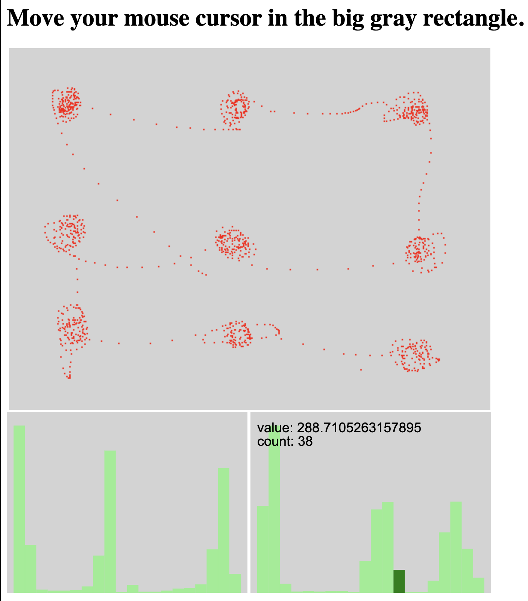

# buckety-buckeroo
Got streaming data and want to create an approximate histogram for it? Want to also render the bins to a canvas without bells and whistles? That's what buckety-buckeroo does for you.

The implementation is based on the paper [Streaming Parallel Decision Trees](http://jmlr.org/papers/volume11/ben-haim10a/ben-haim10a.pdf).

# Demo


[Online demo](https://marioslab.io/dump/buckety-buckeroo)
[Source](https://github.com/badlogic/buckety-buckeroo/blob/main/index.html)

# Usage
You can include `buckety-buckeroo` directly on your page via.
```
<script src="https://cdn.jsdelivr.net/npm/@marioslab/buckety-buckeroo@1.0.1/dist/iife/buckety-buckero.min.js">
```

Every function and "class" is exposed on the global `buckety` object.

If you manage your project dependencies with NPM, add `buckety-buckeroo` as follows:

```
npm install @marioslab/buckety-buckeroo
```

Then import all exported functions and classes in your source files via:

```
import * as buckety from "@marioslab/buckety-buckeroo"
```

Create a histogram and specify the number of buckets it should have:

```
let histogram = new buckety.Histogram(100);
```

Then add values:

```
histrogram.addValue(432.32);
histrogram.addValue(-0.21);
histrogram.addValue(64);
```

You can calculate approximate quantiles:

```
let tenPercentQuantile = histogram.quartile(0.1);
```

Or perform your own calculation by iterating the buckets:

```
let mean = 0;
for (let bucket of histogram.buckets) {
	mean += bucket.value;
}
mean /= histogram.buckets.length;
```

Finally, you can draw the histogram to a canvas.

```
<canvas></canvas>
<script>
	let canvas document.querySelector("canvas");
	let histogram = new buckety.Histogram(20);
	let histogramChart = new buckety.HistrogramChart(canvas, { histrogram: histogram });
	histrogramChart.render();
</script>
```

See the demo above for an interactive example.

# Will you add feature $X
No, but I might accept pull requests.

# Development
Install Git, Node.js, and Visual Studio Code. Then:

```
git clone https://github.com/badlogic/buckety-buckeroo
cd buckety-buckeroo
npm run dev
code.
```

Press `F5`, modify code, press `CTRL+S`, see the page auto-update with your changes, set some breakpoints.